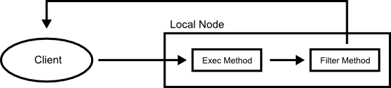
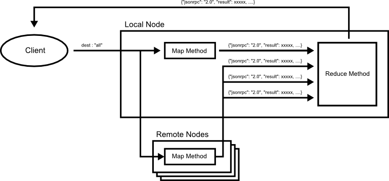
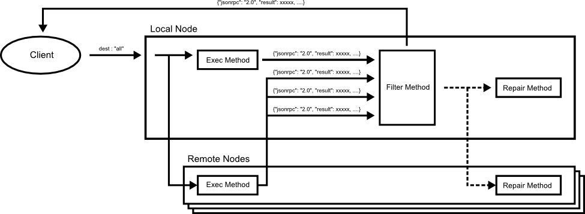
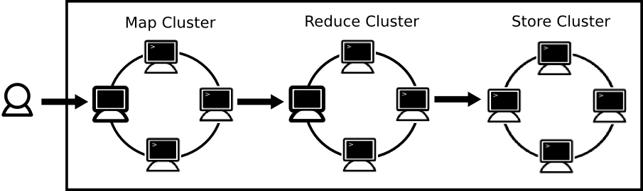

# Round Design Patterns

## Share

### Default Parameters

### Configuration

## Execution

### Pipe

The filter is a design pattern to connect methods defined in a node like Unix pipes.

#### Diagram



To execute multi methods combinatorially, use the batch request at the following.
```
[
{"jsonrpc": "2.0", "method": "exec_method", "params": ..., ....}
{"jsonrpc": "2.0", "method": "filter_method", "params": ..., ....}
]
```
For another way to execute the methods combinatorially, you can use the route function as the following.

```
{
  methods : [
  {jsonrpc : "2.0", "method":"exec_method", ....}
  {jsonrpc : "2.0", "method":"filter_method", ....}
  ]

  routes : [
  {src : "exec_method", dest : "filter_method"}
  ]
}
```

### MapReduce

The MapReduce is a design pattern to ....

#### Diagram



#### Script

```
{
  methods : [
    {jsonrpc : "2.0", "method":"map_method", ....}
    {jsonrpc : "2.0", "method":"reduce_method", ....}
  ]

  routes : [
    {src : "map_method", dest : "reduce_method"}
  ]
}
```

### Quorum

The quorum pattern is a design pattern to .... .... such as eventual consistency model.

#### Diagram



#### Script

```
{
  methods : [
    {jsonrpc : "2.0", "method":"exec_method", ....}
    {jsonrpc : "2.0", "method":"filter_method", ....}
  ]

  routes : [
    {src : "exec_method", dest : "filter_method"}
  ]
}
```

### Transaction

### Multi Clusters

The multi clusters pattern is a design pattern to .... like [MapReduce][map-reduce] programming mode.




### Transaction

JSON-RPC batch

## Decide

### Vote

### Election

## Failer Detection

### Node Repair

### Failer Detection

### Immutable

In distributed system

[map-reduce]: http://en.wikipedia.org/wiki/MapReduce
