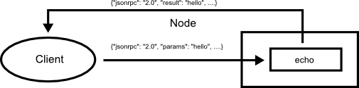
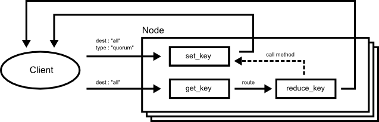
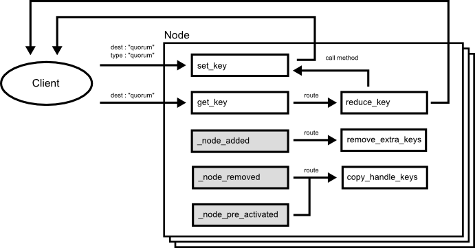

# Applications

## Echo

The sample is a simple only to echo the specified parameters.



### Script

```
{
  methods : [
    {
      "name": "echo",
      "language": "js",
      "code": "function echo(params) {return params;}"",
    }
  ]
}

```

## Chubby

The sample is a simple distributed key value store to share same small data such as configuration data in all nodes in a cluster like Google's chubby [1]. The sample is based on [Quorum Pattern](./round_design_pattern.md).



### Script

```
{
  methods : [
    {"name":"set_key", ....}　,
    {"name":"get_key", ....}　,
    {"name":"reduce_key", ....}
  ]

  routes : [
    {"src" : "local.get_key", "dest" : "local.reduce_key"}
  ]
}
```

## Key Value Store

The sample is a simple distributed key value store which is based on [eventual consistency](http://en.wikipedia.org/wiki/Eventual_consistency) such as Dynamo[2] and Cassandra[3]. The sample is based on [Quorum Pattern](./round_design_pattern.md).



### Script

```
{
  methods : [
    {"name":"set_key", ....}　,
    {"name":"get_key", ....}　,
    {"name":"reduce_key", ....} ,
    {"name":"remove_extra_key", ....} ,
    {"name":"copy_handle_key", ....}
  ]

  routes : [
    {"src" : "local.get_key", "dest" : "local.reduce_key"} ,
    {"src" : "local._node_added", "dest" : "local.remove_extra_key"} ,
    {"src" : "local._node_removed", "dest" : "local.copy_handle_key"} ,
    {"src" : "local._node_pre_activated", "dest" : "local.copy_handle_key"} ,
  ]
}
```

## Search Engine

## File Storage

## Map Reduce

## CDN (Contents Delivery Network)

# References

[1] :  M. Burrows, “The Chubby lock service for loosely-coupled distributed
systems,” in OSDI ’06: Proceedings of the 7th symposium on Operating
systems design and implementation, 2006, pp. 335–350.

[2] : DeCandia, G., et al. 2007. Dynamo: Amazon’s highly available key-value store. In Proceedings of the 21st ACM Symposium on Operating Systems Principles: 205-220.

[3] : Lakshman, A., Malik, P. 2009. Cassandra—a decentralized structured storage system. In the 3rd ACM SIGOPS International Workshop on Large-scale Distributed Systems and Middleware.
