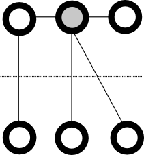
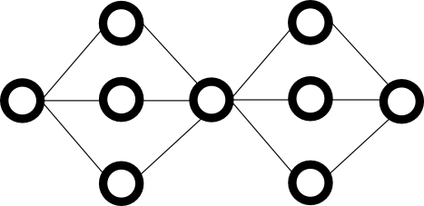
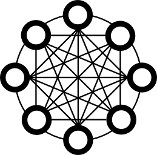

English [Japanese](round_conversions_jp.md)

# Features

## Programming Model

Round is designed to develop any distributed applications using the single programming model. The programming model is a computer which has some programmable engines with a memory, and it can receive and send messages with other nodes and clients.

## Network Topology

Programming model of existing consensus services, like [Chubby \[1\]][1] and [Zookeeper \[4\]][4], are typical client server model.

[MapReduce \[2\]][2] ...

Round ...

Asymmetric network topology is not always efficient ...

## Dynamics

In the typical distributed programming, developers create the distributed applications as static using some static programming languages such as Java and C.

In Round, developers can create the applications using dynamic programming languages, and update the programming codes in the nodes dynamically. Developers can select the favorite programming language to create the applications because Round supports many dynamic and static programming languages such Java, JavaScript, Lua and C++.

## Simplicity

Generally, it is difficult to maintain distributed applications because developers have to understand the distributed framework and applications for updating the functions.

In Round, developer can update the functions easily without understanding the distributed framework and applications because the all methods are defined as RPC. To update the function, developer have to understand only the method input and output interfaces.

Round recommends to create the methods simply. To create complex functions, connect the simple methods using the route function like [Unix pipelines \[5\]][5].

## Code reuse

Developers can distribute the methods which are created dynamic programming languages, and the other developer can import the methods easily. For example, a developer releases programming codes of their methods on Github, the other developers can import the methods easily using rpm command.

## Conversion

| Category | Feature | Round | [ZooKeeper \[1\]][1] | Consul | etcd | Chubby |
|---|---|---|---|---|---|
| Basic | Implementation | C++ | Java | Go | Go | ? |
| Notification | Synchronous | Asynchronous | Synchronous | | Synchronous | Synchronous |
| Consensus Protocol | Paxos | O | O [1] | X | X | |
| | [Raft][raft] | X | O [1] | [Raft][raft] | Raft |  |
| Membership | Multicast | O | (none) | [O][gossip-consul] | ? | (?) |
| | Gossip | O | X | X | X |  |  |

## Refrences

- \[1\] : [Mike Burrows, Chubby Distributed Lock Service, OSDI'06, 2006][1]
- \[2\] : [Jeffrey Dean and Sanjay Ghemawat, MapReduce: Simplified Data Processing on Large Clusters, OSDI'04, 2004][2]
- \[3\] : [Apache Storm][3]
- \[4\] : [Apache ZooKeeper][1]
- \[5\] : [Conway's Game of Life][5]
- \[6\] : [Pipeline (Unix)][6]

[1]: http://research.google.com/archive/chubby.html
[2]: http://research.google.com/archive/mapreduce.html
[3]: https://storm.apache.org/
[4]: http://zookeeper.apache.org/
[5]: http://en.wikipedia.org/wiki/Conway%27s_Game_of_Life
[6]: http://en.wikipedia.org/wiki/Pipeline_%28Unix%29

[raft]: https://raftconsensus.github.io/
[raft-consul]: http://www.consul.io/docs/internals/consensus.html
[gossip-consul]: http://www.consul.io/docs/internals/gossip.html
