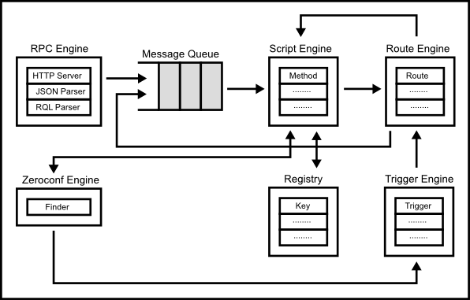
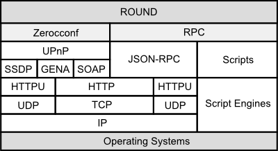
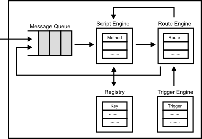

# Round Internals

## Architecture Overview

### Core Module

Round node is a programmable RPC ([Remote Procedure Call](http://en.wikipedia.org/wiki/Remote_procedure_call)) node. Its core module is consist of the following engines.

#### RPC Engine

The RPC engine receives [JSON-RPC][json-rpc] messages from clients and othe nodes over HTTP or HTTPU. The HTTP server is implemented using [uHTTP for C++][uhttp].

#### Zeroconf Engine

The Zeroconf engine watches other node activities in the network. Its engine is implemented using [mUPnP for C++][mupnp].

#### Script Engine

The script engine executes the specified method by RPC messages. The script engine supports some dynamic and static programming languages such as JavaScript, Java, Tcl, and C++.

#### Memory Manager

The memory manager controls a volatility simple key value storage in the local node. The scripts can access the key value storage.

#### Trigger Engine

The trigger engine occurs various events such as other nodes activities. The basic events are defined as default, but you can add user define events too.

#### Route Engine

The route engine can connect the trigger with the methods. Its engine can connect the methods with the other methods too like pipelien of Unix.

### Protocol Stack

Round consists only some open standard network protocols such as [UPnP][upnp-spec] and [JSON-RPC][json-rpc] with standard script engines such as [Java][java] and [JavaScript][js-v8].

### Zeroconf

Round is designed based on [Zeroconf][zero-conf] concept to achieve automatically scalable distributed systems. Specifically, Round uses [UPnP][upnp-spec], Universal Plug and Play, as [Zeroconf][zero-conf] protocol.

### RPC

Round node is a programmable RPC([Remote Procedure Call][rpc] node. Its RPC is based on [JSON-RPC][json-rpc], and Round extends the specification to build distributed system applications.

  The node includes a local HTTP server to handle requests form other node or client. The HTTP server has [RESTful](http://en.wikipedia.org/wiki/Representational_state_transfer) interfaces using [JSON-RPC over HTTP][json-rpc-http].

Round supports some dynamic and static proguramming languages such as Java, JavaScript, Tcl and C++ to set the [RPC][rpc] methods.
Round uses same standard programming engines such as [V8][js-v8].

The received message is split into multiple stages similar to the [SEDA][seda] architecture. Check [Round RPC Specification](./round_rpc.md) and [Round RPC Methods](./round_rpc_methods.md) in more detail.

## Network Topology

Round is based on [consistent hasing](http://en.wikipedia.org/wiki/Consistent_hashing), and each node has a hash code. The hash code is generated based on a ip address and a port of the node using [SHA-256](http://en.wikipedia.org/wiki/SHA-2) algorithm statically.

## Programming Model

Programming model of Round is inspired from some programming models, [Actor model][actor-model], CSP ([Communicating Sequential Processes][csp]) and [Dataflow Programming][df-prog].

Each node of Round is an actor which has a message queue to receive messages from clients or other nodes.

### Scripting

Each node can be received messages from client and other nodes, and the messages are executed by the script engine in the node.

### Routing

The each node can propagate a received message from clients or other nodes to other nodes or local methods using 'route'. The route can chain like pipelien of Unix.

### Trigger

Each node can be received various predefind events, you can connect the events into defined methods using the routing. The developer can create original events too.

## Process

Round's server process is `roundd`, ane the client process is `round`.

# References

1. [UPnP Specifications][upnp-spec]
1. [JSON-RPC 2.0 Specification][json-rpc]
1. [JSON-RPC over HTTP][json-rpc-http]
1. [Zero Configuration Networking (Zeroconf)][zero-conf]
1. [Remote Procedure Call][rpc]
1. [Actor Model][actor-model]
1. [Communicating sequential processes][csp]
1. [Dataflow Programming][df-prog]
1. [Welsh, M., Culler, D., and Brewer, E. 2001. SEDA: an architecture for well-conditioned, scalable internet services][seda].

[upnp-spec]: http://upnp.org/sdcps-and-certification/standards/
[json-rpc]: http://www.jsonrpc.org/specification
[json-rpc-http]: http://jsonrpc.org/historical/json-rpc-over-http.html
[java]: https://java.com/
[js-spec]: http://www.ecma-international.org/publications/standards/Ecma-262.htm
[js-v8]: https://developers.google.com/v8/
[zero-conf]: http://www.zeroconf.org/
[rpc]: http://en.wikipedia.org/wiki/Remote_procedure_call
[seda]: http://dl.acm.org/citation.cfm?id=502057
[actor-model]: http://en.wikipedia.org/wiki/Actor_model
[csp]: http://en.wikipedia.org/wiki/Communicating_sequential_processes
[df-prog]: http://en.wikipedia.org/wiki/Dataflow_programming
[mupnp]: http://www.cybergarage.org/do/view/Main/CyberLinkForCC
[uhttp]: http://www.cybergarage.org/do/view/Main/HttpEngineForCC
[usql]: http://www.cybergarage.org/do/view/Main/SqlEngineForCC
