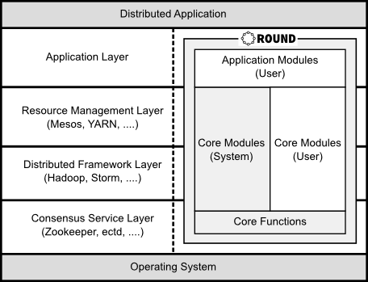
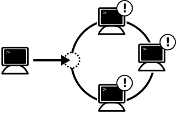
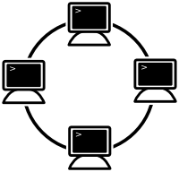
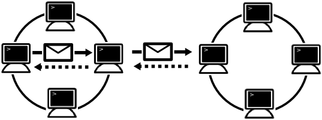
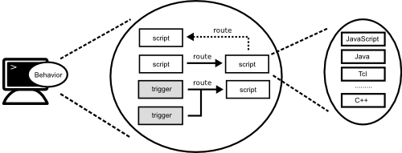

[English](round_overview_jp.md) / Japanese

# 概要

## Roundとは ?

Roundは分散システム開発者や研究者向けの新しいオープンソースのフレームワークです。 Roundは、利用者がより簡単に分散アプリケーションやフレームワークを開発するのを支援します。

Roundの名前は「[円卓の騎士](http://ja.wikipedia.org/wiki/円卓の騎士)」に由来しており、クラスターの全てのノードが等しい役割を持ち、マスターノードが存在していないことを意味しています。

Roundは、分散システム開発の基盤フレームワークであり、以下のような多種多様な分散フレームワークやアプリケーションの開発を支援します。

- コンセンサスサービス (Chubby, ZooKeeper, etcd ...)
- 分散処理フレームワーク (Hadoop, Storm, Spark ...)
- 分散ファイルシステム (GFS, HDFS, ...)
- 分散データベース (Dynamo, Cassndra, ...)
- 分散リソース管理 (Mesos, YARN, ...)

## 設計原則

Roundは以下の原則に基づいて設計されています。

### 簡潔性

簡潔性は重要な原則の一つです。Roundのコアモジュールは極めてシンプルであり最低限の機能のみ実装されています。簡潔さに関連する直交性も重要な原則です。これらの原則により、コアモジュールを簡潔に保つために、冗長な機能は実装されません。

Roundは、従来のモノリシックに分散サービスやアプリケーションを開発するのではなく、Unixパイプラインやマイクロサービス的に、好みの言語で小さなメソッドを定義し組み合わせることで開発します。

### 明確性

コアモジュールの技術仕様については明確に定義されており利用者に公開されています。技術仕様は業界標準のネットワークプロトコルを拡張して定義されています。

コア機能の初期バージョンはC++で実装されていますが、公開されている技術仕様から、JavaやGoなどの他のプログラミング言語でコアモジュールを実装することも可能です。

## 対象領域

Roundのコア機能は非常に小さく、分散システムやアプリケーション開発に必要となるその他の基本的な全てのファンクションはコアモジュールとして提供されています。開発者は分散フレームワークやアプリケーションをコア機能やコアモジュールを利用して構築できます。

Roundは、標準で分散システムのコンセンサスプロトコルや障害検知のような有用なコアモジュールを提供しています。また、開発者はコンセンサスプロトコルなどの新しい分散システムの独自モジュールを、JavaScriptやLuaなどの色々なプログラミング言語を用いて追加できます。

## アーキテクチャ概要

### プログラミングモデル

Roundは並列分散プログラミングモデルとして[メッセージパッシング (message passing)][msgp-model]モデルと[共有メモリ (shared memory)][shmem-model]モデルの両方に対応しています。Roundのメッセージパッシングモデルは[アクターモデル][actor-model]と[CSP][csp-model] (Communicating Sequential Processes)に影響を受けており、そのプログラミングモデルは[リアクティブシステム][reactive]と[アスペクト指向][aspect]の影響を受けています。

Roundのクラスターは複数のノードから構成されます。各ノードは[Lamportモデル][lamport-model]のアクターでクライアントや他のノードからメッセージを受信するための論理クロックとメッセージキューを持ちます。

### オープンスタンダード

Roundは[JSON-RPC][json-rpc]や[UPnP][upnp-spec]などのオープンスタンダードなネットワークプトロコルから構成されます。

また、RoundはJavaやJavaScript、Luaなどの主要なプログラミング言語に対応しています。開発者な好きなプログラミング言語で分散フレームワークやアプリケーションを構築できます。

## 特徴

Roundは簡単に分散フレームワークやアプリケーションを開発できるように次のような特徴があります。

### 自動認識

一般的なクラウドシステムでは、分散サービスを起動するために利用者による設定が必要となります。RoundではZeroconfにより利用者による設定を極力不要になるよう設計されています。

例えば、新しく起動されたRoundノードは、ネットワークに自動的に追加されます。同じネットワークの他のノードは、ノードが追加されたり削除されたりすると、そのイベントを受信します。

Zeroconfとは、利用者による設定が不要な、サービス発見の技術です。Roundでは、すべての新規ノードは特別な設定なしにクラスターに追加され、自動的に利用可能となります。

### 非集中

基本的に、Roundは非集中型の分散システムフレームワークであり、クラスターの全てのノードは等しい役割を持ち、マスターノードがありません。

それに加えて、集中型の分散フレームワークやアプリケーションを構築するために、Roundは自動的にリーダーノードを選出します。

### 自律的

各ノードは開発者により指定された振る舞い基づく自律的なエージェントとして動作します。各ノードは指定された振る舞いにより、同じクラスターや他のクラスターのノードとメッセージを自律的に交換します。

Roundは[ライフゲーム][life-game]のように自律的なプログラミングモデルです。各ノードは振る舞いのコードを自分自身で持っています。各ノードは指定された振る舞いのコードに従ってイベントを自律的に処理します。

### 動的

Roundのノードは自律的でプログラミング可能な[RPC](rpc)ノードです。Roundでは、各ノードに動的にスクリプトを追加したり、イベントをそのスクリプトに関連付けたりしながら、分散システムアプリケーションを構築していきます。

RoundはJavaScriptやJavaなどの複数の動的プログラミング言語に対応していますので、利用者の好みのプログラミング言語で分散システムアプリケーションが開発できます。

[actor-model]: http://en.wikipedia.org/wiki/Actor_model
[csp]: http://en.wikipedia.org/wiki/Communicating_sequential_processes
[reactive]: http://dl.acm.org/citation.cfm?id=101990
[aspect]: https://en.wikipedia.org/wiki/Aspect-oriented_programming
[df-prog]: http://en.wikipedia.org/wiki/Dataflow_programming
[upnp-spec]: http://upnp.org/sdcps-and-certification/standards/
[json-rpc]: http://www.jsonrpc.org/specification
[java]: https://java.com/
[js-spec]: http://www.ecma-international.org/publications/standards/Ecma-262.htm
[life-game]: http://en.wikipedia.org/wiki/Conway%27s_Game_of_Life
[rpc]: http://en.wikipedia.org/wiki/Remote_procedure_call
[lamport-model]: http://en.wikipedia.org/wiki/Lamport_timestamps
[parallel-model]: http://en.wikipedia.org/wiki/Parallel_programming_model
[msgp-model]: http://en.wikipedia.org/wiki/Message_passing
[shmem-model]: http://en.wikipedia.org/wiki/Shared_memory_(interprocess_communication)
[csp-model]: http://en.wikipedia.org/wiki/Communicating_sequential_processes
[paxos]: http://research.microsoft.com/en-us/um/people/lamport/pubs/paxos-simple.pdf
