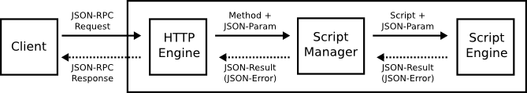

# Script Languages

## Executing Data Flow

Round node has multiple script engines such as JavaScript and Ruby. After the node received JSON-RPC requests from other nodes or clients, the request is executed as the following.



### 1. Parse JSON-RPC request

The HTTP Server parses the JSON-RPC requests, and it returns a error if the request is invalid. Otherwise, it forward the method and JSON parameters to the script manager.

### 2. Get Method Script

The script manager gets the specified method script, it returns a error if the method is not found. Otherwise, it forward the script and JSON parameters to the script engine.

### 3. Execute Script

The script engine executes the script with the JSON parameters, it returns a error if the script language engine for the script is not found. Otherwise, it returns the execute result or error.

## Script Functions

Round supports multiple script language as default, but developer can add other script engines. To support new script language engine, developer must implement the following functions.

| Function | Description |
| --- | --- |
| get_network_state() | Returns all clusters and nodes in the local node. |
| get_cluster_state() | Returns all nodes in the local node. |
| get_node_state()  |Returns the local node status |
| post_method(method, params, obj) | Posts a RPC message to the specified node. |
| set_registry(key, value) | Sets the specified key and value into the local node registry. |
| get_registry(key) | Gets a registry by the specified key from the local node registry. |

### get_network_state()

The get_network_state function returns all clusters and nodes which the local node knows.

#### Parameters

This function has no parameter.

#### Return value

- a JSON string of the network state.

Please check `get_network_state` of [RPC Methods](round_rpc_methods.md) to know the response object in more detail.

#### Example

```
var result = get_network_state();
var jsonResult = JSON.parse(result);
var clusterCount = jsonResult.clusters.length;
```

### get_cluster_state()

The get_cluster_state function returns all nodes which the local node knows in the same cluster.

#### Parameters

This function has no parameter.

#### Return value

- a JSON string of the cluster state.

Please check `get_cluster_state` of [RPC Methods](round_rpc_methods.md) to know the response object in more detail.

#### Example

```
var result = get_cluster_state();
var jsonResult = JSON.parse(result);
var nodeCount = jsonResult.cluster.nodes.length;
```

### get_node_state()

The get_node_state function returns the local node status.

#### Parameters

This function has no parameter.

#### Return value

- a JSON string of the node state.

Please check `get_node_state` of [RPC Methods](round_rpc_methods.md) to know the response object in more detail.

#### Example

```
var result = get_network_state();
var jsonResult = JSON.parse(result);
var nodeAddr = jsonResult.addr;
var nodePort = jsonResult.port;
var nodeHash = jsonResult.hash;
```

### post_method(method, params, obj)

The post_method posts a RPC message to the specified node.

#### Parameters

- method : string
- params : string or JSON string
- obj : node hash or the local node is selected when the parameter is not specified or ''

#### Return value

- a JSON string of the specified method result, or false when the method is failed.

#### Example

The following code shows how to use the post_method function.

```
var key = "name";
var val = "Satoshi Konno";
var result = post_method('get_registry', ''{"key": "name"}', '');
if (!result) {
  .....
}
```

### set_registry(key, value)

The set_registry function sets the specified key and value into the local node registry.

#### Parameters

- key : string
- value : string

#### Return value

- true or false

#### Example

The following code shows how to use the set_registry function.

```
var key = "name";
var val = "Satoshi Konno";
var ok = set_registry(key, val);
```

### get_registry(key)

The get_registry function returns a registry by the specified key from the local node registry.

#### Parameters

- key : string

#### Return value

- a JSON string of the specified registry, or false when the specified registry is not found.

```
{
  "key"  : <string value>
  "value": <string value>,
  "ts"   : <integer value>
  "lts"  : <integer value>
}
```

#### Example

The following code shows how to use the get_registry function.

```
var result = get_registry("name");
if (result != false) {
  var jsonReg = JSON.parse(result);
  var value = jsonReg.value;
  .....
}
```
