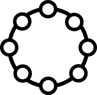

# Round Topology Specification

Round is based on [consistent hasing](http://en.wikipedia.org/wiki/Consistent_hashing), and each node has a hash code. The hash code is generated based on a ip address and a port of the node using [SHA-256](http://en.wikipedia.org/wiki/SHA-2) algorithm statically.



In the current version, Round supports only the simple ring network topology, the hash is computed using the following algorithm.

```
SHA256(ipaddress + node)
```
