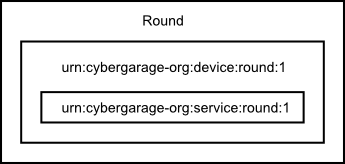

# Round Zeroconf Specification

Round uses a standard Zeroconf specification [UPnP][upnp-spec] to find other nodes automatically.

Round must be implemented based on [UPnP Device Architecture 2.0][upnp-spec], and supprt the following device and service.



## Device Definitions

The Round device must be implemented the following device.

### Device Type

```
urn:cybergarage-org:device:round:1
```

## Service Modeling Definitions

The Round device must be implemented the following service.

### ServiceType

```
urn:cybergarage-org:service:round:1
```

### Actions

The Round's service must be implemented the following actions.

| Name | Req or Opt |
|---|---|
| GetProductInfo | R |
| GetConnectionInfo | R |

- R = Required, O = Optional, X = Non-standard.

#### GetProductInfo

This required action returns the product information.

##### Arguments

| Argument | Direction | relatedStateVariable |
|---|---|---|
| ProductName | Out | Name |
| ProductVersion | Out | Version |

#### GetConnectionInfo

This required action returns the connection information to connect the node.

##### Arguments

| Argument | Direction | relatedStateVariable |
|---|---|---|
| Address | Out | Address |
| Port | Out | Port |
| Protocol | Out | Protocol |
| Path | Out | Path |

[upnp-spec]: http://upnp.org/sdcps-and-certification/standards/
